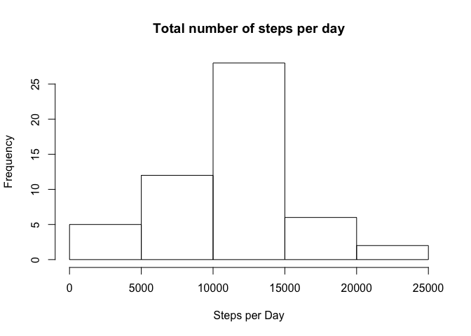
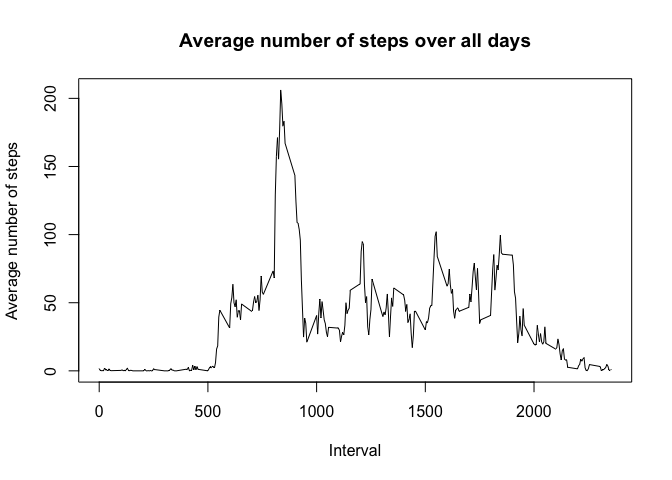
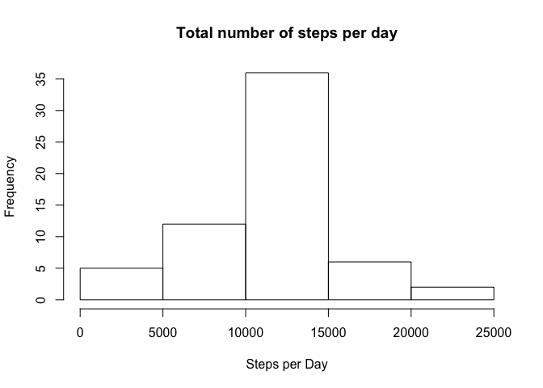
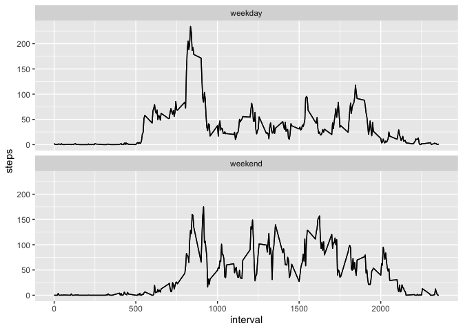

## Loading and preprocessing the data
First, two packages (tidyverse and lubridate) are loaded, 
and then the data is imported. The date variable is changed from a string to a date format. 


```r
library(tidyverse)
library(lubridate)
activity <- read.csv("activity.csv", stringsAsFactors=FALSE)
activity$date<-ymd(activity$date)
```

## What is mean total number of steps taken per day?
The graph shows the average total number of steps per day. 


```r
tots<-activity%>% group_by(date) %>%summarise(steps=sum(steps))
hist(tots$steps, main="Total number of steps per day", xlab="Steps per Day")
```

<!-- -->

```r
summary(tots)
```

```
##       date                steps      
##  Min.   :2012-10-01   Min.   :   41  
##  1st Qu.:2012-10-16   1st Qu.: 8841  
##  Median :2012-10-31   Median :10765  
##  Mean   :2012-10-31   Mean   :10766  
##  3rd Qu.:2012-11-15   3rd Qu.:13294  
##  Max.   :2012-11-30   Max.   :21194  
##                       NA's   :8
```
The mean number of steps per day is 10766, the median number of steps is 10765. 

## What is the average daily activity pattern?
This time-series plot shows the average daily activity pattern, in 5 min 
intervals, averaged across all days.  


```r
pattern<-activity%>% group_by(interval) %>%
      summarise(steps=mean(steps, na.rm=TRUE))

plot(pattern$interval, pattern$steps, type='l', main="Average number of steps over all days", xlab="Interval", ylab="Average number of steps")
```

<!-- -->

```r
#Calculate the row whith the maximum number of steps
(max_steps_which <- which.max(pattern$steps))
```

```
## [1] 104
```

```r
#Calculate the respective interval and number of steps
(pattern[max_steps_which,])
```

```
## # A tibble: 1 x 2
##   interval steps
##      <int> <dbl>
## 1      835  206.
```
The maximum number of steps, which was 206, was taken between minutes 835 and minutes 840. 

## Imputing missing values
In a next step, the missing values are replaced with the mean of the variable, 
across all days and intervals. The new graph now shows the average total number 
of steps per day, without missing values. 
 

```r
(sum(is.na(activity$steps)))
```

```
## [1] 2304
```

```r
act_compl <- activity

for (i in 1:nrow(act_compl)){
      if (is.na(act_compl$steps[i])){
            act_compl$steps_new[i]<-mean(act_compl$steps, na.rm=TRUE)
      } else {
              act_compl$steps_new[i] <- act_compl$steps[i]}
}
tots_compl<-act_compl%>% group_by(date) %>%summarise(steps_new=sum(steps_new))

hist(tots_compl$steps_new, main="Total number of steps per day", xlab="Steps per Day")
```

<!-- -->

```r
summary(tots_compl)
```

```
##       date              steps_new    
##  Min.   :2012-10-01   Min.   :   41  
##  1st Qu.:2012-10-16   1st Qu.: 9819  
##  Median :2012-10-31   Median :10766  
##  Mean   :2012-10-31   Mean   :10766  
##  3rd Qu.:2012-11-15   3rd Qu.:12811  
##  Max.   :2012-11-30   Max.   :21194
```
The mean number of steps per day, as well as the median number, is 10766, 
which is almost the same as for the data set that included missing values. 


## Are there differences in activity patterns between weekdays and weekends?
These plots examine the difference in activity between weekdays and weekends. 

```r
act_weekday <- act_compl %>% mutate(day_of_week=weekdays(date))
act_weekday$factor <- act_weekday$day_of_week
act_weekday$factor <- recode_factor(act_weekday$factor, Monday="weekday", Tuesday="weekday", Wednesday="weekday", Thursday="weekday", Friday="weekday", Saturday="weekend", Sunday="weekend")

factor_interval<-act_weekday%>% group_by(interval, factor) %>%
      summarise(steps=mean(steps, na.rm=TRUE))

ggplot(factor_interval,
      aes(x = interval, y = steps)) +
      stat_summary(fun.y="sum", geom="line")+
      geom_line()+
      facet_wrap(~ factor, ncol = 1)
```

<!-- -->


